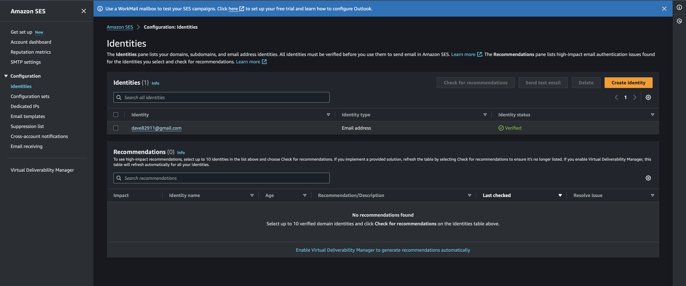
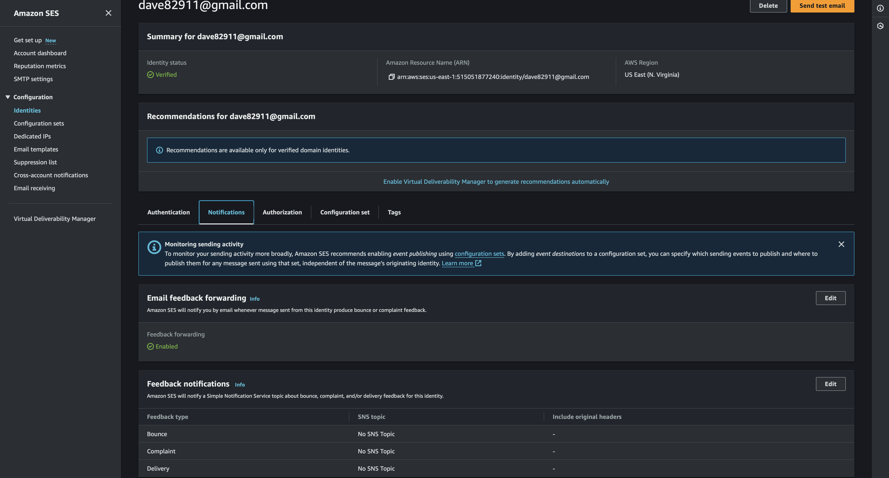

# Challenge Stori transactions report API on AWS

## Overview

This project contains the solution of the challenge: [challenge](./docs/Tech_Challenge_-_Software_Engineer.pdf).

### Proposed solution

The solution consists an application that reads a CSV file from a local or cloud location, the file contains a list of transactions, process the registers then insert them in a local or cloud database finally send an email with a summary of transactions per month.

### Arquitecture

This project can be executed in a local or cloud environment, it contains [serverless framework](https://www.serverless.com) which helps to abstract functions lambda and emulate AWS resources in a local environment and it helps to create AWS Cloud formation templates and deploy the necessary resources to cloud provider using AWS credentials.

### Requirements

It's necessary to have installed some basic technologies to run this project locally, here is the whole list:

* [Docker](https://www.docker.com), it must be available via CLI.
* Command Terminal or CLI.
* [Postman](https://www.postman.com) or any other REST client is highly recommended.
* Fast internet connection is a nice to have to download the images from [docker hub](https://hub.docker.com)
* An email account
* A database client which can connect to postgresql

### How to run this project locally

Once you have all the required software installed go to the root of this project using the CLI and executed the next command:

```
docker compose up

```
You will see an output like this when it finished


* It means that the project is running on port 3000 and it is ready to receive request.
* The postgresql database is running and it contains the new tables and migrations.


### Test the API from REST Client locally

You can test this api with the next curl in a new terminal or import the curl to postman client.

```
curl --location 'http://localhost:3000/api/stori-challenge/report-transactions/:email'
```
**Note: Remember change :email to your email.**

When you make the request you must wait an email like this: 


Please review the database to see all inserted registers from the document

Connect to the database using the next credentials:

```
Database: postgresql
User: homestead
Password: secret
Host: localhost
Port: 3001
Database: stori_transactions
```

Once you have a successfully connection to the database please make sure you execute the next query:

```
select * from transactions;
```

When the query finish, It must show the next registers:


### Test the API from REST Client on AWS

Yes, you can test this API directly from AWS

I deployed all the architecture on the cloud

Consume the next curl from your terminal or Postman client

```
curl --location 'https://n324ir4j9b.execute-api.us-east-1.amazonaws.com/api/stori-challenge/report-transactions/:email'
```
**Note: Remember change :email to your email.**

When you make the request you must wait an email like this: 


Please review the database to see all inserted registers from the document

Connect to the database using the next credentials:

```
Database: postgresql
User: StoriChallenge2024
Password: StoriDB2024
Host: stori-challenge-dev-storitransactionsdatabase-f0lcewpwgna0.crei3ibkfguc.us-east-1.rds.amazonaws.com
Port: 5432
Database: stori_transactions
```

Once you have a successfully connection to the database please make sure you execute the next query:

```
select * from transactions;
```

When the query finish, It must show the next registers:


## knowledge and experience

I have the enough knowledge to deploy and maintain existing architecture on AWS, I will left some screenshots about the deployed resources.

All of this resources were created using a cloudformation template autogenerated by the serverless framework.

I declarated the services using the serverless.yml file.

### AWS RDS


### AWS API Gateway


### AWS Lambda


### AWS S3


### AWS CloudFormation


### AWS CloudWatch


### AWS SES




